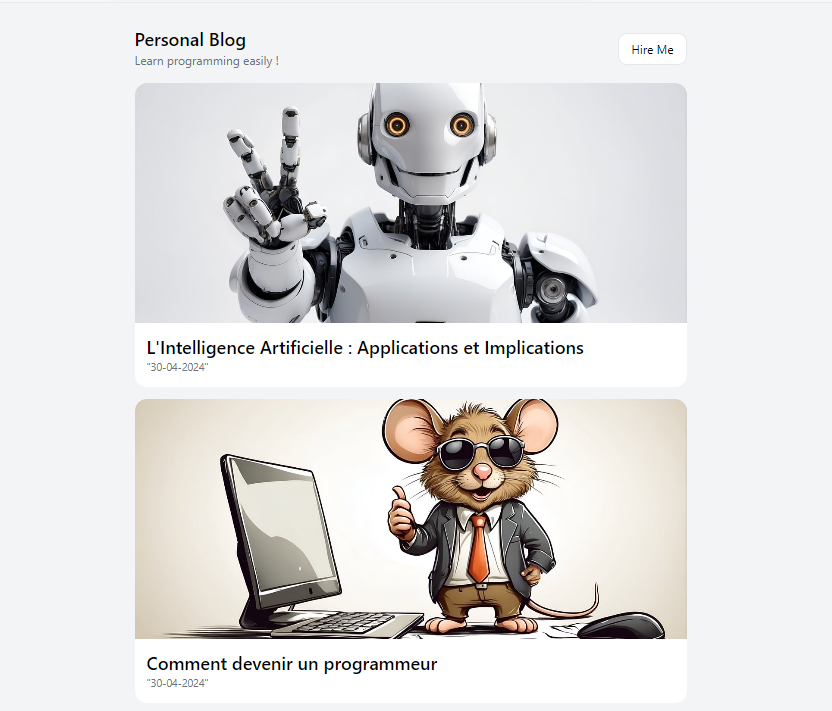

# Mon Blog Personnel

Ce projet est un blog personnel créé avec Nuxt.js et Nuxt Content.

## Aperçu



## Installation

1. Clonez ce dépôt :

```bash
git clone https://github.com/VotreNom/mon-blog-personnel.git
```

2. Installez les dépendances:

```bash
cd mon-blog-personnel
npm install
```

3. Lancez l'application en mode développement:

```bash
npm run dev
```

## Contact

Pour toute question ou commentaire, n'hésitez pas à me contacter à l'adresse e-mail suivante: kouagoutiburce@gmail.com